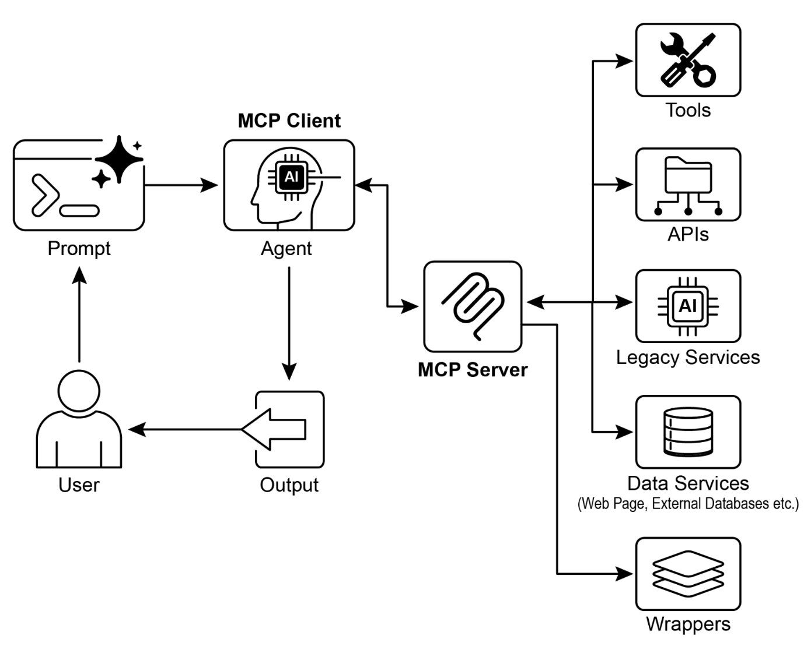

# Agentic Design Patterns: Learning Notes

## Book Overview
This document tracks my learning progress through *Agentic Design Patterns* by Antonio Gulli. The book covers 21 key patterns for building intelligent agents, structured into four parts:

*   **Part One: Foundations** (Chapters 1-7)
    *   Core patterns for structuring workflows: 
        *   [**Prompt Chaining**](#chapter-1-prompt-chaining-the-pipeline-pattern)
        *   [**Routing**](#chapter-2-routing)
        *   [**Parallelization**](#chapter-3-parallelization)
        *   **Reflection**
        *   **Tool Use**
        *   **Planning**
        *   **Multi-Agent system**
*   **Part Two: Management** (Chapters 8-11)
    *   Managing agent state and capabilities: 
        *   [**Memory**](#chapter-8-memory-management)
        *   [**Learning and Adaptation**](#chapter-9-learning-and-adaptation)
        *   [**MCP**](#chapter-10-model-context-protocol-mcp)
        *   **Goal Monitoring**.
*   **Part Three: Robustness** (Chapters 12-14)
    *   Ensuring reliability: **Exception Handling**, **Human-in-the-Loop**, and **Knowledge Retrieval (RAG)**.
*   **Part Four: Advanced** (Chapters 15-21)
    *   Complex agent behaviors: **Inter-Agent Communication**, **Optimization**, **Reasoning**, **Guardrails**, **Evaluation**, and **Prioritization**.

---

## Part 1: Foundations

### Chapter 1: Prompt Chaining (The Pipeline Pattern)
**Core Concept:**
Instead of asking an LLM to do everything in one massive prompt, break the task into a sequence of smaller, specific steps. The output of Step 1 becomes the input for Step 2.

**Why use it?**
*   **Reliability:** Focused prompts reduce hallucinations and errors.
*   **Debuggability:** If the process fails, you know exactly which step broke.
*   **Modularity:** You can tweak or swap individual steps without rewriting the entire logic.

**Example Use Case:**
*   **Input:** Unstructured product description.
*   **Step 1 (Extractor):** Extract raw technical specifications.
*   **Step 2 (Formatter):** Convert that list into a clean JSON object.

### Chapter 2: Routing
**Core Concept:**
Acts as a "traffic controller" that analyzes input and directs it to the most appropriate specialized handler. It introduces conditional logic (if/else) to AI workflows.

**Routing Methods Comparison:**

| Method | Latency | Cost | Flexibility | Best For... |
| :--- | :--- | :--- | :--- | :--- |
| **Rule-Based** | ⚡ Instant | 0️⃣ Zero | ❌ None | Simple commands/jargon |
| **LLM-Based** | 🐢 Slow | 💸 High | ✅ High | Complex, nuanced intents |
| **Semantic** | 🚀 Fast | 💰 Low | 🟡 Medium | 10+ specialized handlers |
| **Structured** | 🐢 Slow | 💸 High | 💎 Maximum | High-stakes business logic |
| **ML Model** | 💨 Med | 💰 Low | 🟡 Medium | High-volume, defined routes |

**1. Rule-Based / Keyword Routing**
*   **How it works:** Uses simple Python logic (`if "refund" in text:`), regex, or exact string matching.
*   **Example:** [chapter_2_router.py](agentic_design/chapter_2_routing/chapter_2_router.py) (Simple logic).

**2. LLM-Based Classification**
*   **How it works:** You ask an LLM: "Is this A, B, or C?" and it returns the category.
*   **Example:** [chapter_2_router.py](agentic_design/chapter_2_routing/chapter_2_router.py) (The LLM Router part).

**3. Semantic Routing (Vector-Based)**
*   **How it works:** Converts input into a mathematical vector (embedding) and compares it to "example" queries for each route.
*   **Example:** [chapter_2_semantic_router.py](agentic_design/chapter_2_routing/chapter_2_semantic_router.py).

**4. Structured Output Routing (The "Contract" Method)**
*   **How it works:** Uses Pydantic to force the LLM to provide a structured object with multiple signals (urgency, category, sentiment).
*   **Example:** [chapter_2_advanced_pydantic_router.py](agentic_design/chapter_2_routing/chapter_2_advanced_pydantic_router.py).

**5. ML Model-Based Routing (Fine-Tuned Classifier)**
*   **How it works:** Uses a smaller, classic machine learning model (like DistilBERT) that has been specifically **fine-tuned** on your routing task.
*   **Example:** [chapter_2_ml_model_router.py](agentic_design/chapter_2_routing/chapter_2_ml_model_router.py).

### Chapter 3: Parallelization
**Core Concept:**
Executing multiple independent tasks or agent calls **simultaneously** rather than sequentially. Results are typically aggregated or synthesized at the end of the parallel branch.

**Why use it?**
*   **Performance:** Drastically reduces total execution time by eliminating sequential bottlenecks.
*   **Diversity of Thought:** Allows multiple specialized agents to analyze the same input from different perspectives concurrently.
*   **Efficiency:** Ideal for tasks like gathering data from multiple APIs or verifying inputs against multiple rule sets.

**Key Implementation Construct (LangChain):**
*   **`RunnableParallel` (or the `Map` pattern):** Allows you to wrap multiple chains into a single unit that runs them in parallel using Python's `asyncio` or threading.

#### Concurrency vs. True Parallelism: A Critical Distinction
A key point from the book is that `asyncio` (used by LangChain for parallel chains) provides **concurrency**, not true parallelism.

*   **Concurrency (`asyncio`)**: This is like a single, very fast chef multitasking in a kitchen. The chef starts a slow task (like boiling water), and instead of waiting, immediately moves to another task (like chopping vegetables). When the slow task is done, the chef switches back. This happens on a **single CPU core**. It's extremely effective for **I/O-bound tasks** (waiting for APIs, databases, files) because the program doesn't waste time "watching the water boil." For agents calling multiple APIs, this provides a massive performance boost.

*   **True Parallelism (`multiprocessing`)**: This is like having multiple chefs in the kitchen, each working on a different task at the exact same physical moment. This requires **multiple CPU cores**. This is best for **CPU-bound tasks** (heavy mathematical computation, data processing) where the work is all local computation, not waiting.

For most agentic workflows, which are heavily I/O-bound, the concurrency provided by `asyncio` delivers the desired "parallel" speed improvements.

**Example Implementation:** [parallelization_multifunction.py](agentic_design/chapter_3_parallelization/parallelization_multifunction.py), [langchain_diverse_analysis.py](agentic_design/chapter_3_parallelization/langchain_diverse_analysis.py)

### Chapter 4: Reflection
**Core Concept:**
Reflection is an agentic pattern where an agent **evaluates its own work, identifies flaws, and iteratively improves its output**. It's a "self-correction" mechanism that moves beyond simple one-shot answers.

**The core loop of reflection is:**
1.  **Generation**: The agent produces an initial "draft" of the output (e.g., a plan, a code snippet, a summary).
2.  **Critique (Reflection)**: The agent, often adopting a different persona like "code reviewer" or "skeptical editor," analyzes its own draft.
3.  **Refinement**: The agent takes the original draft and the critique, then generates an improved version. This can be a single pass (**Basic Reflection**) or a continuous loop until the output is approved (**Iterative Reflection**).

**Why it's important:**
*   **Improves Quality**: Catches errors, logical flaws, and hallucinations.
*   **Handles Complexity**: Allows agents to tackle problems that require multiple steps of reasoning and refinement.
*   **Increases Reliability**: Leads to more robust and accurate final outputs.

#### Advanced Reflection: Connecting Goal Setting and Memory

**Example Implementation:** [chapter_4_reflection.py](agentic_design/chapter_4_reflection/chapter_4_reflection.py)

Reflection becomes truly powerful when combined with other agentic patterns:

*   **Reflection + Goal Setting**: The critique isn't just about whether the output is "good" in a vacuum, but whether it **achieves the original goal**. The reflector agent is explicitly given the user's initial goal as the primary benchmark for its critique. This ensures that refinements are always moving the agent closer to the desired outcome.

*   **Reflection + Memory**: This is how an agent "learns" from its mistakes.
    1.  **Store Learnings**: After a successful reflection loop, the agent stores the "bad version -> critique -> good version" triplet in its long-term memory (e.g., a vector database).
    2.  **Retrieve Learnings**: The next time the agent is given a *similar* task, it first searches its memory for relevant past corrections.
    3.  **Apply Learnings**: It uses the retrieved information as in-context examples or instructions in its prompt for the *initial generation*. This allows the agent to produce a high-quality output on the first try, effectively learning and adapting its behavior over time.

**Example Implementation:** [chapter_4_reflection.py](agentic_design/chapter_4_reflection/chapter_4_reflection.py)

### Chapter 5: Tool Use
**Core Concept:**
Tool Use (or **Function Calling**) is the pattern that enables an LLM to interact with the external world. It marks the transition from an LLM that only *generates text* to an agent that can *perform actions*. The LLM is given a "toolbox" of available functions, and it outputs a structured request (like JSON) specifying which tool to call and with what parameters.

**The Standard Workflow:**
1.  **Discovery**: The agent is provided with tool definitions (names, descriptions, and JSON schemas for inputs).
2.  **Selection & Planning**: The LLM analyzes the user prompt and decides which tool(s) are necessary.
3.  **Execution**: The client application intercepts the LLM's request, runs the actual code/API, and captures the result.
4.  **Observation**: The tool's output is fed back to the LLM.
5.  **Synthesis**: The LLM uses the tool result to provide a final answer or plan its next action.

**Why Tool Use is Essential:**
*   **Actionable Intelligence**: Enables agents to search the web, query databases, send emails, or manipulate files.
*   **Accuracy & Precision**: For tasks like math or data retrieval, tools provide grounding in fact and logic that LLMs might otherwise hallucinate.
*   **Up-to-Date Information**: Tools can fetch real-time data (e.g., stock prices, weather) that is not present in the LLM's static training data.

**Key Design Principles:**
*   **Clear Descriptions**: The LLM relies heavily on the tool's description to understand *when* and *why* to use it.
*   **Strict Schemas**: Using Pydantic or JSON Schema ensures the LLM provides correctly typed and formatted arguments.
*   **Sandboxing**: For security, tools should run in a restricted environment to prevent unauthorized access or system damage.

**Example Implementation:** [database_agent.py](agentic_design/chapter_5_tool_use/database_agent.py)

### Chapter 6: Planning
**Core Concept:**
Planning is an agentic pattern where an agent breaks down a complex, multi-step goal into a structured sequence of smaller, manageable tasks **before** taking action. This moves the agent from being *reactive* (deciding the next step one-by-one) to being *proactive* (creating a roadmap for the entire goal).

**Why Planning is Important:**
*   **Complexity Management**: Allows agents to tackle high-level, multi-faceted goals that cannot be solved in a single step.
*   **Logical Consistency**: Prevents agents from getting stuck in loops or wandering off-topic during long, complex tasks.
*   **Efficiency**: Identifies dependencies and optimal task ordering (e.g., "I need the data from Tool A before I can use Tool B").

**Common Planning Patterns:**
*   **Plan-and-Execute**: The agent generates a complete, step-by-step plan first, then executes each step in order.
*   **Iterative Planning (Plan-Check-Update)**: The agent creates an initial plan, executes the first step, evaluates the result, and then **dynamically updates the plan** based on new information. This is much more robust for unpredictable real-world scenarios.
*   **Multi-Agent Planning**: A lead "Architect" agent creates a plan and then delegates different tasks to specialized "Worker" agents.

**The Loop of a Planning Agent:**
1.  **Task Decomposition**: Break the goal into sub-tasks.
2.  **Sequencing**: Order the tasks based on logic and dependencies.
3.  **Execution**: Perform the tasks (often using tools).
4.  **Monitoring**: Check progress against the plan and adjust if necessary.
5.  **Completion**: Verify the original high-level goal has been met.

#### Comparison of Planning Agent Architectures

| System | Best For | Logic Type | Implementation Effort |
| :--- | :--- | :--- | :--- |
| **Plan-and-Execute** | Predictable, well-defined tasks | Static (Plan first, then act) | 🟢 Low |
| **Reasoning-Loop (ReAct)** | Unpredictable, exploratory tasks | Dynamic (Think and act in a loop) | 🟢 Low |
| **Hierarchical** | Large-scale, complex projects | Managed (Manager plans, workers act) | 🔴 High |
| **Self-Correcting** | Mission-critical, messy environments | Resilient (Plan, act, and re-plan) | 🟡 Medium |

*   **Plan-and-Execute (The "Simple Strategist")**: A high-reasoning model produces a static list of steps, and a tool-enabled executor methodically loops through them.
*   **Reasoning-Loop (ReAct / Chain-of-Thought)**: The agent thinks and acts in a continuous loop. The "plan" is internal and updated after every tool call.
*   **Hierarchical Multi-Agent (The "Management" System)**: An "Architect" agent does nothing but plan and delegate tasks to specialized "Worker" agents (e.g., a "Database Specialist").
*   **Self-Correcting Planner (The "Resilient" Agent)**: Combines planning with **Reflection (Ch 4)**. A separate "Critic" agent reviews the plan for flaws *before* execution, and the agent can "re-plan" at runtime if a step fails.

**Example Implementation:** [planning_agent.py](agentic_design/chapter_6_planning/planning_agent.py), [hierarchical_agent.py](agentic_design/chapter_6_planning/hierarchical_agent.py)

### Chapter 7: Multi-Agent Collaboration
**Core Concept:**
Instead of relying on a single, monolithic agent, this pattern structures a system as a cooperative ensemble of specialized agents to solve complex, multi-domain problems. Each agent has specific roles, tools, and reasoning capabilities.

**Collaboration Forms:**
*   **Sequential Handoffs (The Pipeline):** Agents pass outputs directly to the next agent in line. Best for clear, step-by-step workflows.
*   **Parallel Processing:** Multiple agents work on independent tasks simultaneously. A "coordinator" synthesizes the results.
*   **Debate and Consensus:** Agents with different perspectives or personas argue and evaluate options to arrive at a balanced decision.
*   **Hierarchical Structures:** A "Manager" agent formulates a plan and dynamically delegates tasks to "Worker" agents based on their skills.
*   **Expert Teams:** Agents represent specific domains (e.g., Legal, Financial, Marketing) and collaborate like a cross-functional human team.
*   **Critic-Reviewer:** An iterative loop where a "Creator" agent drafts output and a "Critic" agent reviews it against specific standards (an extension of the Reflection pattern).

**Practical Applications:**
*   **Software Development:** Requirements Analyst -> Code Generator -> Tester -> Documenter.
*   **Research & Synthesis:** Researcher (Search) -> Analyst (Identify Trends) -> Writer (Final Report).
*   **Marketing Campaigns:** Market Research -> Copywriter -> Graphic Designer -> Social Media Manager.
*   **Network Remediation:** Triage Agent -> Specialist Agents (Security, Performance, Ops).

**Example Implementation:** [supervisor_system.py](agentic_design/chapter_7_multi_agent/supervisor_system.py), [network_system.py](agentic_design/chapter_7_multi_agent/network_system.py), [realistic_network.py](agentic_design/chapter_7_multi_agent/realistic_network.py), [crewai_collaboration.py](agentic_design/chapter_7_multi_agent/crewai_collaboration.py)

**Communication Structures:**
*   **Network (Peer-to-Peer):** Direct, decentralized interaction between agents. Resilient but can be chaotic.
*   **Supervisor:** A dedicated hub agent manages communication, task allocation, and conflict resolution.
*   **Hierarchical:** Multiple levels of supervisors (Managers of Managers). Scales well for massive projects.

---

## Part 2: Management

### Chapter 8: Memory Management
**Core Concept:**
Memory enables agents to retain and utilize information from past interactions, observations, and learning experiences. It allows agents to maintain context across multi-turn conversations and improve their performance over time.

**Types of Memory:**

1.  **Short-Term Memory (Contextual Memory):**
    *   **Scope:** Immediate conversation or task.
    *   **Implementation:** Typically managed via the **Context Window** of the LLM. 
    *   **Techniques:** Storing recent message history, summarizing older turns, or extracting key entities to stay within token limits.

2.  **Long-Term Memory (Persistent Memory):**
    *   **Scope:** Across multiple sessions or even different users.
    *   **Implementation:** External storage like databases, vector stores (RAG), or knowledge graphs.
    *   **Categorization:**
        *   **Semantic Memory:** Remembering facts and concepts (e.g., user preferences).
        *   **Episodic Memory:** Remembering specific past events or sequences of actions.
        *   **Procedural Memory:** Remembering "how" to do things (e.g., refined instructions or rules learned via reflection).

**Key Implementation Frameworks:**

*   **Google ADK:**
    *   **`Session`:** Manages the lifecycle of a single interaction thread.
    *   **`session.state`:** A persistent "scratchpad" (dictionary) for storing variables across a session.
    *   **`MemoryService`:** A searchable repository for long-term information (e.g., Vertex AI Memory Bank).

*   **LangChain / LangGraph:**
    *   **`ConversationBufferMemory`**: Simple storage of raw chat history.
    *   **`ChatMessageHistory`**: Manual control over the message list.
    *   **`BaseStore` / `InMemoryStore`**: (LangGraph) Hierarchical storage using namespaces and keys for persistent cross-session memory.

**Example Implementation:** [langchain_memory.py](agentic_design/chapter_8_memory/langchain_memory.py)

[TODO] we go back to review this chapter after RAG. 

### Chapter 9: Learning and Adaptation
**Core Concept:**
Transitioning from static agents to dynamic systems that evolve through experience. Learning allows an agent to refine its strategies, decision-making, and behavior based on historical data and environmental feedback.

**The Big Picture of Agentic Learning:**
*   **Reinforcement Learning (RL):** Agents try actions and receive rewards/penalties to learn optimal behaviors.
*   **Supervised Learning:** Learning from labeled examples (e.g., human-in-the-loop corrections).
*   **Unsupervised Learning:** Identifying patterns in unlabeled data. Crucial for:
    *   **Intent/Topic Discovery:** Grouping similar user requests to identify new capabilities the agent needs.
    *   **Anomaly Detection:** Sensing when an agent's reasoning or tool use "looks wrong" compared to normal behavior (self-correction/guardrails).
    *   **Vector Embeddings:** Creating mathematical representations of "meaning" to power RAG and memory retrieval.
*   **Few-Shot/Zero-Shot Learning:** Leveraging LLM capabilities to adapt to new tasks with minimal instructions.
*   **Online Learning:** Continuous updates to knowledge based on real-time data streams.
*   **Memory-Based Learning:** Recalling past experiences to adjust current actions (Episodic/Procedural memory).

**Advanced Optimization Techniques:**
*   **PPO (Proximal Policy Optimization):** A stable RL algorithm that avoids drastic changes to the agent's policy, ensuring reliable training.
*   **DPO (Direct Preference Optimization):** A simpler alternative to PPO for aligning LLMs with human preferences without requiring a separate reward model.

**Case Studies in Self-Improvement:**
*   **SICA (Self-Improving Coding Agent):** An agent that iteratively modifies its own source code and tools (e.g., creating custom AST symbol locators) to improve performance on benchmarks.
*   **AlphaEvolve & OpenEvolve:** Evolutionary frameworks that use an ensemble of LLMs to generate, evaluate, and evolve code modifications in an iterative loop.

**Example Implementation:** [chapter_9_learning_and_adaptation/](agentic_design/chapter_9_learning_and_adaptation/) (Directory for learning-based examples)

[TODO] can build an automate NN optimization agent for learning MNIST dataset. 
[TODO] build a simple prompt optimizer for a certain task and use an another agent and human-in-loop evaluation to improve

---

### Chapter 10: Model Context Protocol (MCP)
**Core Concept:**
MCP is an open standard that acts as a "Universal Adapter" for AI models. It solves the "N×M" problem (N models connecting to M data sources) by providing a unified protocol (JSON-RPC 2.0).

**Architecture:**
*   **Host:** The AI application (e.g., Claude Desktop, IDE).
*   **Client:** The bridge inside the host that speaks MCP.
*   **Server:** A dedicated service that exposes specific capabilities.
    *   **Resources:** Static data (logs, files).
    *   **Tools:** Executable functions (API calls, scripts).
    *   **Prompts:** Templates for specific tasks.

**Key Distinction (MCP vs. Tool Calling):**
*   **Tool Calling:** 1-to-1, static definition. The model knows only what you explicitly code for it.
*   **MCP:** Dynamic discovery. The model can ask an MCP server "What can you do?" and adapt to available tools at runtime.

#### Understanding the MCP Interaction: Agent, Client, and Server
[Understanding the MCP Interaction: Agent, Client, and Server](agentic_design/chapter_10_mcp/mcp_interaction_explained.md)

#### Transport Layers: `stdio` vs. `HTTP/SSE`
MCP works over a network using **HTTP/SSE (Server-Sent Events)**, which is crucial for distributed agents or web-based clients.
[MCP Transport Layers: `stdio` vs. `HTTP/SSE`](agentic_design/chapter_10_mcp/mcp_transport_layers_explained.md)

### Additional considerations for MCP (from the Book)

When evaluating MCP for a use case, consider these crucial aspects:

*   **Primitives:** Understand the distinction between **Resources** (static data), **Tools** (executable functions), and **Prompts** (templates guiding LLM interaction).
*   **Discoverability:** MCP clients can dynamically query servers to discover available tools and resources "just-in-time".
*   **Security:** Implementations require robust **authentication and authorization** to control access and permitted actions.
*   **Implementation:** Utilize SDKs (like FastMCP) to abstract boilerplate code and simplify client/server creation.
*   **Error Handling:** The protocol must clearly communicate errors back to the LLM to enable self-correction.
*   **Deployment:** Choose between **Local servers** (for speed/security) and **Remote servers** (for shared, scalable access).
*   **Processing Mode:** MCP supports both **on-demand** interactive sessions and large-scale **batch** processing.
*   **Transport Layer:** Use **`stdio`** for local inter-process communication, or **`HTTP/SSE`** for remote client-server connections.

### Deeper Dive into FastMCP:

**Advanced `FastMCP`: Middleware, Lifespan Events, and Dependencies**
    *   Adding custom logic to the server, such as `middleware` to log every tool call, `lifespan` events to manage database connections, or using dependency injection.
    *   [Advanced FastMCP: Building Production-Ready Servers](agentic_design/chapter_10_mcp/advanced_fastmcp.md)

### Enhanced security for MCP 

To build production-grade agentic systems, security must be implemented in layers (Defense in Depth). For MCP, this involves securing credentials, verifying requests, and isolating execution environments.

1.  **Credential Isolation ("Server Holds the Keys"):** 
    *   **Concept:** The MCP Server stores all sensitive API keys and secrets locally. The agent never sees or touches these credentials. 
    *   **Benefit:** Prevents "Prompt Injection" from leaking secrets. Even if an attacker tricks the agent, the credentials remain secured within the server's environment.

2.  **Authentication & Authorization Middleware:**
    *   **Implementation:** Use FastMCP middleware to intercept every request.
    *   **Check:** Verify API keys or JWT tokens in the request metadata before executing any tool. This ensures only authorized agents/hosts can access specific server capabilities.

3.  **Execution Sandboxing (Execution Isolation):**
    *   **Dockerization:** Run the MCP server within a Docker container. This creates a "blast radius" limit; if a tool is compromised or executes malicious code (e.g., `rm -rf /`), only the container is affected, protecting the host system.
    *   **Environment Limits:** Use tools like `nsjail` or OS-level restrictions to further limit the server's visibility into the file system and network.

4.  **Principle of Least Privilege:**
    *   **User Identity:** Run the server process as a non-root, restricted user.
    *   **Resource Access:** Grant the server read-only access where possible and only to the specific directories or databases strictly required for its tools.

5.  **Input & Output Sanitization:**
    *   **Validation:** Use Pydantic to enforce strict schemas for tool arguments (e.g., regex for IDs, range checks for numbers).
    *   **Filtering:** Use middleware to scan tool outputs for sensitive patterns (like internal IPs or PII) before returning data to the LLM.

#### [TODO] Further read
[MCP official guide](https://modelcontextprotocol.io/docs/getting-started/intro)

---

## Part 3: Robustness

### Chapter 14: Knowledge Retrieval (RAG)
**Core Concept:**
Retrieval-Augmented Generation (RAG) grounds an LLM's response in external, verifiable data. It transforms an LLM from a closed-book conversationalist into a powerful knowledge processing system.

**Why use it?**
*   **Accuracy:** Reduces hallucinations by anchoring responses in facts.
*   **Up-to-Date:** Accesses rapidly changing or private data (e.g., company wikis).
*   **Explainability:** Provides citations for human verification.

**The RAG spectrum:**

| Pattern | Logic | Best For... |
| :--- | :--- | :--- |
| **Naive RAG** | Retrieve -> Augment -> Generate | Simple Q&A on static documents |
| **Graph RAG** | Traverse Knowledge Graph | Fragmented info across multiple docs; relationship discovery |
| **Agentic RAG** | Plan -> Multi-step Retrieve -> Reason | Complex queries; conflict resolution; gap filling |

**Example Implementation:** [simple_rag.py](agentic_design/chapter_14_rag/simple_rag.py), [agentic_rag.py](agentic_design/chapter_14_rag/agentic_rag.py)

**1. Core Concepts:**
*   **Chunking & Embeddings:** Documents are broken into meaningful pieces and converted into numerical vectors. 
*   **Retrieval Techniques:** 
    *   **Vector Search:** Semantic similarity (using algorithms like **HNSW**).
    *   **BM25:** Traditional keyword-based ranking.
    *   **Hybrid Search:** Fuses Vector and BM25 for maximum precision and recall.
*   **Vector Databases:** Specialized storage like Chroma, Pinecone, or pgvector.

**2. Agentic RAG: The "Active" Retriever**
Introduces a reasoning layer that acts as a gatekeeper and refiner:
*   **Source Validation:** Analyzes metadata to prioritize the most current or authoritative source (e.g., 2025 Policy vs. 2020 Blog post).
*   **Conflict Resolution:** Identifies and reconciles contradictory data points between retrieved documents.
*   **Multi-step Synthesis:** Decomposes complex comparative queries (e.g., "Compare our pricing vs. Competitor X") into separate sub-searches.
*   **Gap Filling:** Detects when internal knowledge is insufficient and dynamically activates external tools like **Web Search**.

**3. Graph RAG: The "Contextual" Retriever**
Navigates a structured network of entities and relationships rather than just searching for text similarity.
*   **Entity Extraction:** Identifying key concepts (nodes) and their connections (edges) from unstructured text.
*   **Community Detection:** Grouping related nodes to generate global summaries of large datasets.
*   **Multi-hop Reasoning:** Answering questions that require connecting disparate facts (e.g., "How does Pattern A influence Outcome C?").
*   **Best For:** Global summarization and discovering hidden relationships across fragmented documents.

[TODO] Build a simplified Graph RAG implementation using NetworkX and LLM-based entity extraction in `chapter_14_rag/`.

**4. Key Challenges:**
*   **Context Fragmentation:** Info spread across multiple documents.
*   **Retrieval Noise:** Irrelevant chunks confusing the LLM.
*   **Latency & Cost:** Multi-step agentic reasoning is slower and uses more tokens than naive retrieval.

---

## Part 4: Advanced

### Chapter 15: Inter-Agent Communication (A2A)
**Core Concept:**
Inter-Agent Communication (A2A) enables diverse AI agents to collaborate by exchanging information and delegating tasks through a standardized, asynchronous protocol. It moves beyond single-system multi-agent setups to a distributed ecosystem of agents.

**Key Components:**
*   **Core Actors:**
    *   **User/System:** The originator of a request or goal.
    *   **A2A Client (Agent):** acts on behalf of a user or system to request work from other agents (e.g., a Manager or Coordinator).
    *   **A2A Server Agent:** Remote agent that provides an HTTP endpoint to process client requests and return results to client. 
*   **Agent Cards:** Metadata files (often in JSON) that describe an agent's identity, capabilities, available tools, and API endpoints. Think of it as a "Resume" or "Swagger" for an agent.
*   **Agent Discovery:** Mechanisms for finding other agents, such as   
    - well-known URIs (`/.well-known/agent.json`), 
    - curated registries,
    - direct configuration.
*   **Asynchronous Tasks:** Work is structured as "Tasks" with unique IDs and states (e.g., `submitted`, `working`, `completed`, `failed`).
*   **Messages & Artifacts:** Agents communicate via messages containing metadata (attributes) and payloads (parts). They can also exchange "Artifacts" like files or complex data objects.

**Why use it?**
*   **Interoperability:** Allows agents built on different frameworks (LangChain, ADK, CrewAI) to talk to each other.
*   **Scalability:** Supports long-running, complex processes across distributed systems.
*   **Decoupling:** Agents don't need to know the internal workings of other agents, only their public interface (Agent Card).

**Communication Patterns:**
*   **Request/Response (Polling):** Client agent asks for a task to be done and periodically checks the status.
*   **Push Notifications (Webhooks):** Server agent notifies the client agent when a task is finished.
*   **Streaming (SSE/Websockets):** Real-time updates on task progress or incremental results.

**Method Comparison:**

| Method | Best For... | Complexity | Reliability |
| :--- | :--- | :--- | :--- |
| **Polling** | Simple implementations; firewalls | Low | Medium |
| **Webhooks** | Efficient notification; real-time results | Medium | High |
| **SSE** | Progress updates; streaming text | Medium | High |
| **Discovery** | Dynamic ecosystems; scaling agents | High | High |

**Example Implementation:** [chapter_15_a2a/](agentic_design/chapter_15_a2a/)

#### A2A Implementation Explained

This implementation demonstrates a distributed A2A architecture where a **Manager Agent** (Client) delegates specialized work to an **Analyst Agent** (Server) over HTTP.

1.  **Agent Discovery (The Agent Card):**
    *   The Analyst Agent hosts an `agent_card.json` at the `/.well-known/agent.json` endpoint. 
    *   This card acts as a machine-readable "resume" that describes the agent's capabilities (`analyze_sentiment`, `trend_forecast`) and its API endpoints.
    *   The Client uses this for **Discovery**: before sending work, it can verify the agent's identity and supported tools.

2.  **Asynchronous Task Pattern (Server-Side):**
    *   When the Manager Agent calls the Analyst, it doesn't wait for the result in a single request. 
    *   Instead, the Analyst Agent returns a `task_id` immediately and processes the analysis in a background thread. This is crucial for A2A tasks that might take a long time to complete.
    *   Tasks transition through states: `submitted` -> `working` -> `completed`.

3.  **Polling Pattern (Client-Side):**
    *   The Manager Agent (using LangGraph and tools) implements a **Polling Loop**. 
    *   It periodically checks the status of the `task_id` via a GET request.
    *   Once the status is `completed`, the client retrieves the final `result` and feeds it back into the LLM's conversation context.

4.  **Streaming Pattern (SSE - Server-Sent Events):**
    *   The Server yields a stream of events using `StreamingResponse`. 
    *   The Client connects to `/tasks/{task_id}/events` and receives real-time progress updates (e.g., "Connecting to market data feed...") and the final result.
    *   **Best for:** User interfaces or manager agents that need immediate feedback on long-running tasks.
    *   **Example:** [test_sse_client.py](agentic_design/chapter_15_a2a/test_sse_client.py)

5.  **Push Pattern (Webhooks):**
    *   The Client provides a `callback_url` when submitting a task.
    *   The Server, upon completing the task, sends an HTTP POST request to that URL with the results.
    *   **Best for:** Fully automated, "fire-and-forget" workflows between different agentic systems.
    *   **Example:** [test_webhook_client.py](agentic_design/chapter_15_a2a/test_webhook_client.py)

**Key Takeaway:** This pattern allows agents built on different frameworks (e.g., LangGraph talking to a raw FastAPI agent) to collaborate reliably across a network without maintaining a persistent, fragile connection.

#### Further reading
[TODO] [A2A protocol](https://github.com/a2aproject/A2A)

---

## Part 5: Emerging Trends & Specialized Knowledge

### Skills and Evolvable Agents
**Core Concept:**
Skill Creation is the process where an agent moves beyond pre-defined tools and transient prompts to build a persistent, verified "Skill Library." It transforms an agent from a static system into an evolutionary one that acquires new capabilities through experience.

**Prompt vs. Skill: The Boundary**

| Feature | Prompt (Instructions) | Skill (Capability) |
| :--- | :--- | :--- |
| **Nature** | Natural language "software for the brain" | Modular, executable code or verified logic |
| **Lifespan** | Transient (session-based) | Persistent (stored in a Library/Vector DB) |
| **Verification** | Subjective (Output based on reasoning) | Objective (Verified by tests/execution) |
| **Role** | Tells the agent **how to think** | Tells the agent **how to do** |

**Boundary:** A prompt becomes a skill when it is **codified, tested, and indexed** for future retrieval.

**The Evolutionary Loop (Voyager Pattern):**
1.  **Encounter:** Agent faces a new, repeatable task.
2.  **Creation:** Agent writes code/logic to solve the task (Prompt-driven).
3.  **Verification:** A "Critic" agent or automated test suite validates the logic.
4.  **Indexing:** The verified logic is saved as a "Skill" in a Vector Database.
5.  **Retrieval:** For future tasks, the agent searches its "Skill Library" first before trying to reason from scratch.

[TODO] Implement a "Skill-Learner" agent in Chapter 9 that saves successful Python snippets to a local skill directory.

---
